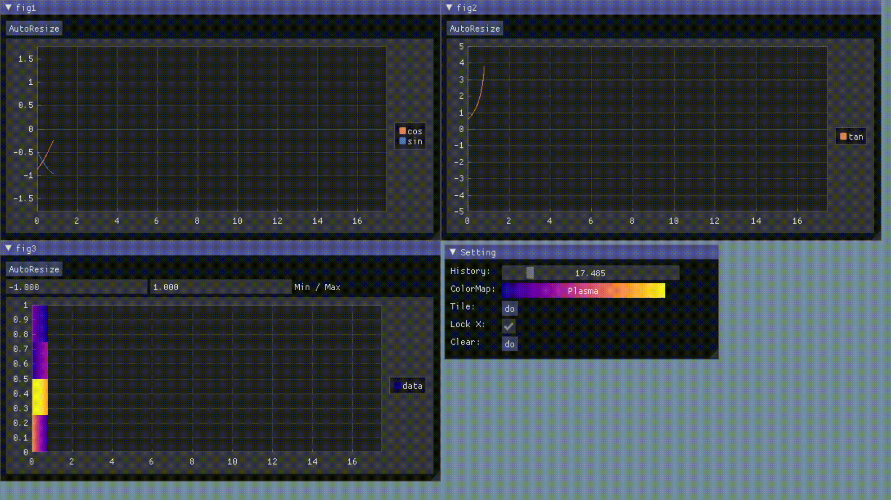

# ipip: Realtime Signal Monitor

## Preview



**Python Code:**

```python
import requests, json, time, math

url = 'http://127.0.0.1:1132'
sess = requests.Session()

while True:
    tm = time.time()
    sess.post(url, data=json.dumps({
        'time': tm,
        'fig1': {
            'sin': math.sin(tm),
            'cos': math.cos(tm),
        },
        'fig2': {
            'tan': math.tan(tm),
        },
        'fig3': {
            'data': [math.sin(tm), math.cos(tm), math.sin(tm * 2), math.cos(tm * 2)]
        }
    }))
    time.sleep(0.01)
```

**MATLAB Code:**

```matlab
url='http://127.0.0:1132';
while true
    time = now * 60 * 60 * 24;
    data = struct(...
        'time', time,...
        'fig1', struct(...
            'sin', sin(time),...
            'cos', cos(time)...
        )...,
        'fig2', struct('tan', tan(time)),...
        'fig3', struct('data', [sin(time) cos(time) sin(time*2) cos(time*2)]),...
    );
    webwrite(url, data);
    pause(0.01);
end
```

You can set value to `null` to avoid subplot update.

## Install

```bash
git clone https://github.com/KEKE046/ipip.git
cd ipip
git submodule init
git submodule update
mkdir build && cd build
cmake --build . && sudo cmake --install .
```

## Run

```bash
ipip #run on port 1132
ipip 2333 # run on port 2333
```
